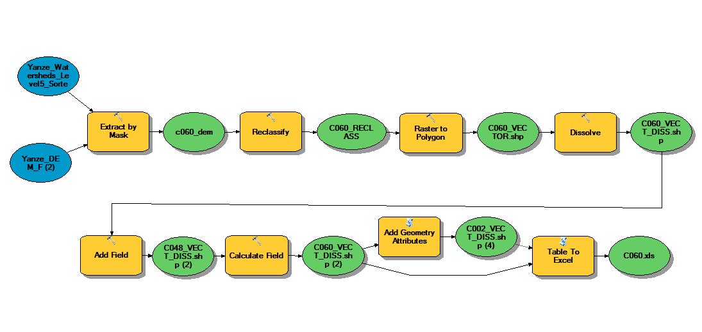

```{r setup, include=FALSE, echo = FALSE}
knitr::opts_chunk$set(echo = TRUE, include=TRUE, warning=FALSE, message=FALSE)
```
***
## I. Overview

In order to simplify the process of generating data required to draw an hypsometric curve of each sub-catchment in Yanze watershed, an ArcMap model was developed to perform the five steps involved in this process in one go. These steps are: 1) extract the DEM of the sub-catchment, 2) reclassify the DEM into classes of equidistant elevation height, 3) convert the reclassified DEM to vector using the ‘Value’ field, 4) dissolve the features using the ‘Value’ field, 5) calculate the area of each polygon, 6) export the table to a text file. 



The present report outlines the results of this process. For each of the 93 sub-catchments of Yanze watershed, we will import the text file generated from ArcMap and process it to generate the hypsometric curve and integral for the sub-catchment. 

## II. Used R Packages

In addition to the core R libraries, the following are the packages that we will be using to generate hypsometric curves and integrals for Yanze sub-catchments:

```{r packages}
library(dplyr) # For preprocessing data
library(ggplot2) # For drawing the hypsometric curve
library(sjPlot) # For producing the coefficient table of the fitted model
library(PolynomF) # For building a polynomial equation of the model and integrating it
library(knitr)
```

## III. Results Per Sub-Catchment

The text file exported from ArcMap will be imported into R for  processing. First, the unnecessary variables will be deleted and only the elevation intervals and corresponding areas will remain. Secondly, the data will be normalized (for elevation, we first substract the minimum elevation and then divide by the range. For area, we divide each entry by the total area of the sub-catchment). Thirdly, we plot the data on a 2D chart showing the curve drawn from the normalized data. Finally, we fit a 3rd degree polynomial equation to the data and integrate it within the limits of 0 and 1 to produce the hypsometric integral metric of the sub-catchment.

```{r loop}
watersheds <- 1:93
min_max <- read.csv("Minimum-Maximum.csv", header = TRUE)

all_data <- list()
for (i in watersheds){
  if (i < 10)
    n <- paste("C00", i, sep = "")
  else
    n <- paste("C0", i, sep = "")

# Read in the data and preprocess it
minimum <- min_max$minimum[i]
maximum <- min_max$maximum[i]
file <- paste(n, ".csv", sep = "")
data <- read.csv(file)
data <- data %>% select(ELEV, AREA_GEO)
data <- mutate(data, ELEV_NORM = (ELEV - minimum)/(maximum - minimum))
data <- mutate(data, AREA_NORM = cumsum(AREA_GEO)/sum(AREA_GEO))

# Build the Hypsometric curve object
g <- ggplot(data = data, aes(x = AREA_NORM, y = ELEV_NORM)) 
g <- g + geom_line(color = "blue", size = 2) 
g <- g + geom_point(color = "green", size = 3, shape = 18) 
g <- g + labs(title = paste(i, ". Hypsometric Curve  of Catchment ", n, sep = ""), x = "% of Relative Area",  y = "% of Relative Elevation") 
g <- g + theme(panel.background = element_rect(fill = "#BFD5E3", colour = "#6D9EC1", size = 2, linetype = "solid"), panel.grid.major = element_line(size = 0.5, linetype = 'solid',colour = "white"), panel.grid.minor = element_line(size = 0.25, linetype = 'solid', colour = "white"))

# Determine the Hypsometric Integral
# First, let's define a polynomial equation that fits the curve
fit = lm(ELEV_NORM ~ poly(AREA_NORM, 3), data = data)

# Second, we display the coefficients of the fitted equation in a well-formatted table
# If the p-values of any of them is too high or the R-squared value is too low, then a better model will need to be fitted
coef_table <- tab_model(fit)

# Finally, we build the polynomial equation and calculate the integral
x <- polynom()
p = summary(fit)$coefficients[2,1] * x + summary(fit)$coefficients[3,1] * x^2 + summary(fit)$coefficients[4,1] * x^3
HI <- integral(p, c(0,1))

# Output the results
print(g)
#print(coef_table)
print(paste("The polynomial equation of sub-catchment ", n, " is ", p, sep = ""))
print(paste("The hypsometric integral of sub-catchment ", n, " is ", round(HI, 3), sep = ""))
#Build the main data frame
catchment_details <- list("minimum" = minimum, "maximum" = maximum, "data" = data, "equation" = p, "h_integral" = HI)
all_data[[n]] <- catchment_details
}
```

### IV. Summary of Results

```{r summary}
summary_table <- data.frame(x1 = character(), 
                     x2 = numeric(),
                     x3 = numeric(),
                     x4 = numeric(),
                     x5 = numeric(),
                     stringsAsFactors = FALSE)
colnames(summary_table)<-c("CODE","MIN_ELEV", "MAX_ELEV", "AREA", "H_INTEGRAL")
 for (i in watersheds){
     if (i < 10)
    n <- paste("C00", i, sep = "")
  else
    n <- paste("C0", i, sep = "")
 CODE <- n
 MIN_ELEV <- all_data[[n]]$minimum
 MAX_ELEV <- all_data[[n]]$maximum
 AREA <- round(sum(all_data[[n]]$data$AREA_GEO),2)
 H_INTEGRAL <- round(all_data[[n]]$h_integral,3)
 summary_table[i,] <- c(CODE, MIN_ELEV, MAX_ELEV, AREA, H_INTEGRAL)
 }
kable(summary_table)
```

